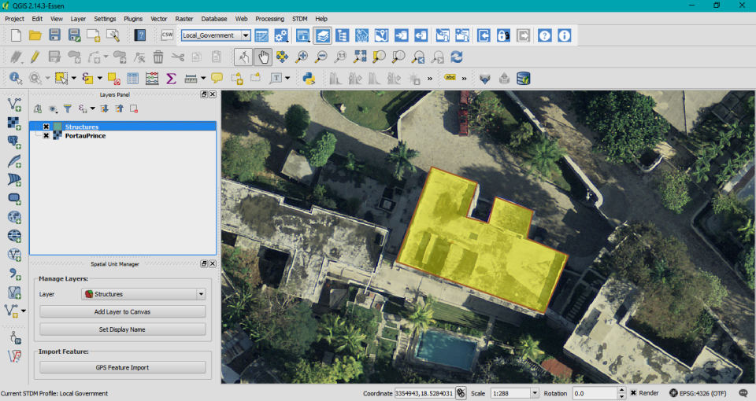

**Social Tenure Domain Model**
==============================

The Social Tenure Domain Model (STDM) is a pro-poor land information tool that provides a flexible approach for representing people-land relationships. The tool provides a practical approach for representing these relationships independent of the level of formality, legality, and technical accuracy.

Some of the functionality provided by the tool include:

-   Enabling the design of new or extension of existing data configurations using an intuitive configuration wizard;

-   Allowing for the definition of custom, application-wide, hierarchies of administrative units;

-   Supporting the design of custom templates for map-based documents/reports;

-   Enabling the generation of map-based documents in batch using custom templates;

-   Providing intuitive import and export wizards that support both textual and spatial data in different formats.

For more information about STDM and its documentation, please visit [www.stdm.gltn.net](http://www.stdm.gltn.net/).

### Third Party Software

STDM is built on top of free and open-source geospatial software products. The client has been developed as a QGIS Python plugin, whereas the backend is based on a PostgreSQL/PostGIS database stack. These are required prior to using STDM.

### Installation

STDM can be installed in two ways:

1.  For beginners - using the all-in-one installer which can be downloaded from [the STDM website](http://www.stdm.gltn.net/downloads/). This will install PostgreSQL, PostGIS, QGIS (with the STDM plugin embedded), and copy sample data (optional).

2.  For advanced users – using the QGIS plugin manager:

    1.  In QGIS Desktop, go to menu **“Plugins -&gt; Manage and Install Plugins…”** On the **“Plugins”** dialog, select **“Settings”** tab.

    2.  Click **“Add…”** to open repository details dialog. The dialog allows you to enter STDM repository properties, enter the details as shown below:
        
        

        -   In the **Name** field enter: GLTN Plugin Repository

        -   In the **URL** field enter: <http://stdm.gltn.net/plugin/plugins.xml>

    3.  Check the **“Enabled”** option then select **“OK”** to close.

    4.  The GLTN repository entry should now be visible on the **“Plugin repositories”** list.

        

    5.  While still on the **“Plugins”** window, select **“Not installed”** tab, then scroll down and look for **“Social Tenure Domain Model”** on the list of **“Not installed”** plugins. Select it and click **“Install plugin”.**

    6.  QGIS will download and install the STDM plugin. The plugin should now be available on the **“Installed”** page and also on the QGIS toolbar and main menu respectively.
        
        

    7.  Now you are ready to start using STDM.

    > This option will require that PostgreSQL and PostGIS be installed beforehand. In addition, an empty spatially-enabled database needs to have been created prior to using STDM.
    >
    > **Note:** If you have issues when downloading the plugin, first confirm if the network settings are okay. On the QGIS menu go to **“Settings -&gt; Options”** In the **“Options”** dialog box select **“Network”** tab and check your proxy settings are okay. For more details on setting up network options, please read the QGIS documentation available [here](http://docs.qgis.org/testing/en/docs/user_manual/).

### License

STDM is free software; you can redistribute it and/or modify it under the terms of the GNU General Public License version 2 (GPL v2) as published by the Free Software Foundation. The full GNU General Public License is available in LICENSE.txt or [here](http://www.gnu.org/licenses/gpl-2.0.html).
    

### How to Participate

-   For more information, please visit [www.stdm.gltn.net](http://www.stdm.gltn.net/) or subscribe to: [lists.osgeo.org/cgi-bin/mailman/listinfo/stdm-user](http://lists.osgeo.org/cgi-bin/mailman/listinfo/stdm-user)

-   To receive important news and updates around STDM in general, subscribe to: [lists.osgeo.org/cgi-bin/mailman/listinfo/stdm-announce](http://lists.osgeo.org/cgi-bin/mailman/listinfo/stdm-announce)

-   If you find an issue working with STDM, please report it so that developers can check and fix it. To report a bug, subscribe to: [lists.osgeo.org/cgi-bin/mailman/listinfo/stdm-dev](http://lists.osgeo.org/cgi-bin/mailman/listinfo/stdm-dev) or post it in GitHub at: <https://github.com/gltn/stdm/issues>

-   To browse the source codes or extend the core platform, access the repository here: <https://github.com/gltn/stdm>

